# Modelo completo do banco (MySQL 8)



Este arquivo contem o modelo completo proposto para persistencia do bot, com:

- conexoes
- usuarios internos (id unico)
- identificadores (pn, lid, jid, username)
- dados do Baileys (auth/keys)
- store (chats, contatos, grupos, mensagens)
- tabelas auxiliares (labels, blocklist, eventos, midia, etc.)

## Diagrama (ASCII)

```
connections
  |
  +-- auth_creds
  +-- signal_keys
  +-- chats -----------+------ chat_users
  +-- wa_contacts_cache|
  +-- groups -----+    |
  +-- messages ---+----+------ message_events
  +-- lid_mappings
  +-- labels ---------- label_associations
  +-- blocklist
  +-- events_log
  +-- events_log_archive
  +-- newsletters ----- newsletter_events
  +-- group_events
  +-- group_join_requests
  +-- user_devices
  +-- message_failures
  +-- bot_sessions
  +-- commands_log
  +-- message_users
  +-- chat_users
  |
  +-- users
       |
       +-- user_identifiers
       +-- user_aliases
       +-- wa_contacts_cache (user_id)
       +-- group_participants
       +-- messages (sender_user_id)
       +-- message_users
       +-- chat_users
       +-- lid_mappings (user_id)
       +-- blocklist (user_id/actor_user_id)
       +-- labels (actor_user_id)
       +-- label_associations (actor_user_id)
       +-- events_log (actor/target)
       +-- events_log_archive (actor/target)
       +-- message_events (actor/target)
       +-- message_failures (actor)
       +-- commands_log (actor)
       +-- group_events (actor/target)
       +-- group_join_requests (actor)
       +-- newsletter_participants
       +-- newsletter_events (actor/target)

groups
  |
  +-- group_participants

messages
  |
  +-- message_media
  +-- message_text_index
  +-- message_users

chats
  |
  +-- chat_users
```

## Diagrama (Mermaid)

```mermaid
erDiagram
  connections ||--o{ auth_creds : "fk_auth_creds_conn"
  connections ||--o{ blocklist : "fk_block_conn"
  connections ||--o{ bot_sessions : "fk_bot_sessions_conn"
  connections ||--o{ chat_users : "fk_chat_users_conn"
  connections ||--o{ chats : "fk_chats_conn"
  connections ||--o{ commands_log : "fk_commands_conn"
  connections ||--o{ events_log : "fk_events_conn"
  connections ||--o{ events_log_archive : "fk_events_archive_conn"
  connections ||--o{ group_events : "fk_group_events_conn"
  connections ||--o{ group_join_requests : "fk_join_req_conn"
  connections ||--o{ group_participants : "fk_group_part_conn"
  connections ||--o{ groups : "fk_groups_conn"
  connections ||--o{ label_associations : "fk_label_assoc_conn"
  connections ||--o{ labels : "fk_labels_conn"
  connections ||--o{ lid_mappings : "fk_lid_conn"
  connections ||--o{ message_events : "fk_events_conn"
  connections ||--o{ message_failures : "fk_message_failures_conn"
  connections ||--o{ message_media : "fk_media_conn"
  connections ||--o{ message_text_index : "fk_text_conn"
  connections ||--o{ message_users : "fk_message_users_conn"
  connections ||--o{ messages : "fk_messages_conn"
  connections ||--o{ newsletter_events : "fk_news_events_conn"
  connections ||--o{ newsletter_participants : "fk_news_part_conn"
  connections ||--o{ newsletters : "fk_newsletters_conn"
  connections ||--o{ signal_keys : "fk_signal_keys_conn"
  connections ||--o{ user_aliases : "fk_user_aliases_conn"
  connections ||--o{ user_devices : "fk_user_devices_conn"
  connections ||--o{ user_identifiers : "fk_user_ident_conn"
  connections ||--o{ users : "fk_users_conn"
  connections ||--o{ wa_contacts_cache : "fk_contacts_cache_conn"
  labels ||--o{ label_associations : "fk_label_assoc_label"
  messages ||--o{ message_media : "fk_media_msg"
  messages ||--o{ message_text_index : "fk_text_msg"
  messages ||--o{ message_users : "fk_message_users_msg"
  users ||--o{ blocklist : "fk_block_actor"
  users ||--o{ blocklist : "fk_block_user"
  users ||--o{ chat_users : "fk_chat_users_user"
  users ||--o{ group_join_requests : "fk_join_req_actor"
  users ||--o{ group_join_requests : "fk_join_req_user"
  users ||--o{ group_participants : "fk_group_part_user"
  users ||--o{ groups : "fk_groups_owner"
  users ||--o{ label_associations : "fk_label_assoc_actor"
  users ||--o{ labels : "fk_labels_actor"
  users ||--o{ lid_mappings : "fk_lid_user"
  users ||--o{ message_users : "fk_message_users_user"
  users ||--o{ messages : "fk_messages_sender"
  users ||--o{ newsletter_participants : "fk_news_part_user"
  users ||--o{ user_aliases : "fk_user_aliases_user"
  users ||--o{ user_devices : "fk_user_devices_user"
  users ||--o{ user_identifiers : "fk_user_ident_user"
  users ||--o{ wa_contacts_cache : "fk_contacts_cache_user"
```



```sql
CREATE TABLE connections (
  id VARCHAR(64) PRIMARY KEY,
  label VARCHAR(100) NULL,
  created_at TIMESTAMP DEFAULT CURRENT_TIMESTAMP,
  updated_at TIMESTAMP DEFAULT CURRENT_TIMESTAMP ON UPDATE CURRENT_TIMESTAMP
) ENGINE=InnoDB DEFAULT CHARSET=utf8mb4;

CREATE TABLE users (
  id BINARY(16) PRIMARY KEY,
  connection_id VARCHAR(64) NOT NULL,
  display_name VARCHAR(255) NULL,
  created_at TIMESTAMP DEFAULT CURRENT_TIMESTAMP,
  deleted_at TIMESTAMP NULL,
  updated_at TIMESTAMP DEFAULT CURRENT_TIMESTAMP ON UPDATE CURRENT_TIMESTAMP,
  INDEX idx_users_conn (connection_id),
  CONSTRAINT fk_users_conn FOREIGN KEY (connection_id) REFERENCES connections(id)
) ENGINE=InnoDB DEFAULT CHARSET=utf8mb4;

-- Sugestao: gerar id com UUID_TO_BIN(UUID(), 1) para ordenacao melhor em indice

CREATE TABLE user_identifiers (
  connection_id VARCHAR(64) NOT NULL,
  user_id BINARY(16) NOT NULL,
  id_type ENUM('pn','lid','jid','username') NOT NULL,
  id_value VARCHAR(255) NOT NULL,
  created_at TIMESTAMP DEFAULT CURRENT_TIMESTAMP,
  PRIMARY KEY (connection_id, id_type, id_value),
  UNIQUE KEY uq_user_ident (connection_id, user_id, id_type, id_value),
  CONSTRAINT fk_user_ident_user FOREIGN KEY (user_id) REFERENCES users(id),
  CONSTRAINT fk_user_ident_conn FOREIGN KEY (connection_id) REFERENCES connections(id)
) ENGINE=InnoDB DEFAULT CHARSET=utf8mb4;

CREATE TABLE auth_creds (
  connection_id VARCHAR(64) PRIMARY KEY,
  creds_json JSON NOT NULL,
  updated_at TIMESTAMP DEFAULT CURRENT_TIMESTAMP ON UPDATE CURRENT_TIMESTAMP,
  CONSTRAINT fk_auth_creds_conn FOREIGN KEY (connection_id) REFERENCES connections(id)
) ENGINE=InnoDB DEFAULT CHARSET=utf8mb4;

CREATE TABLE signal_keys (
  connection_id VARCHAR(64) NOT NULL,
  key_type VARCHAR(64) NOT NULL,
  key_id VARCHAR(255) NOT NULL,
  value_json JSON NULL,
  updated_at TIMESTAMP DEFAULT CURRENT_TIMESTAMP ON UPDATE CURRENT_TIMESTAMP,
  PRIMARY KEY (connection_id, key_type, key_id),
  CONSTRAINT fk_signal_keys_conn FOREIGN KEY (connection_id) REFERENCES connections(id)
) ENGINE=InnoDB DEFAULT CHARSET=utf8mb4;

CREATE TABLE chats (
  connection_id VARCHAR(64) NOT NULL,
  jid VARCHAR(128) NOT NULL,
  display_name VARCHAR(255) NULL,
  last_message_ts BIGINT NULL,
  unread_count INT NULL,
  data_json JSON NOT NULL,
  deleted_at TIMESTAMP NULL,
  updated_at TIMESTAMP DEFAULT CURRENT_TIMESTAMP ON UPDATE CURRENT_TIMESTAMP,
  PRIMARY KEY (connection_id, jid),
  CONSTRAINT fk_chats_conn FOREIGN KEY (connection_id) REFERENCES connections(id)
) ENGINE=InnoDB DEFAULT CHARSET=utf8mb4;

-- Cache de contatos do WhatsApp (nao e fonte da verdade)
CREATE TABLE wa_contacts_cache (
  connection_id VARCHAR(64) NOT NULL,
  jid VARCHAR(128) NOT NULL,
  user_id BINARY(16) NULL,
  display_name VARCHAR(255) NULL,
  data_json JSON NOT NULL,
  updated_at TIMESTAMP DEFAULT CURRENT_TIMESTAMP ON UPDATE CURRENT_TIMESTAMP,
  PRIMARY KEY (connection_id, jid),
  INDEX idx_contacts_cache_user (connection_id, user_id),
  CONSTRAINT fk_contacts_cache_conn FOREIGN KEY (connection_id) REFERENCES connections(id),
  CONSTRAINT fk_contacts_cache_user FOREIGN KEY (user_id) REFERENCES users(id)
) ENGINE=InnoDB DEFAULT CHARSET=utf8mb4;

CREATE TABLE groups (
  connection_id VARCHAR(64) NOT NULL,
  jid VARCHAR(128) NOT NULL,
  subject VARCHAR(255) NULL,
  owner_user_id BINARY(16) NULL,
  announce TINYINT(1) NULL,
  restrict TINYINT(1) NULL,
  size INT NULL,
  data_json JSON NOT NULL,
  updated_at TIMESTAMP DEFAULT CURRENT_TIMESTAMP ON UPDATE CURRENT_TIMESTAMP,
  PRIMARY KEY (connection_id, jid),
  INDEX idx_groups_owner (connection_id, owner_user_id),
  CONSTRAINT fk_groups_conn FOREIGN KEY (connection_id) REFERENCES connections(id),
  CONSTRAINT fk_groups_owner FOREIGN KEY (owner_user_id) REFERENCES users(id)
) ENGINE=InnoDB DEFAULT CHARSET=utf8mb4;

CREATE TABLE group_participants (
  connection_id VARCHAR(64) NOT NULL,
  group_jid VARCHAR(128) NOT NULL,
  user_id BINARY(16) NOT NULL,
  participant_jid VARCHAR(128) NULL,
  role VARCHAR(16) NULL,
  is_admin TINYINT(1) NULL,
  is_superadmin TINYINT(1) NULL,
  data_json JSON NULL,
  updated_at TIMESTAMP DEFAULT CURRENT_TIMESTAMP ON UPDATE CURRENT_TIMESTAMP,
  PRIMARY KEY (connection_id, group_jid, user_id),
  INDEX idx_group_part_user (connection_id, user_id),
  CONSTRAINT fk_group_part_conn FOREIGN KEY (connection_id) REFERENCES connections(id),
  CONSTRAINT fk_group_part_user FOREIGN KEY (user_id) REFERENCES users(id)
) ENGINE=InnoDB DEFAULT CHARSET=utf8mb4;

CREATE TABLE messages (
  id BIGINT AUTO_INCREMENT PRIMARY KEY,
  connection_id VARCHAR(64) NOT NULL,
  chat_jid VARCHAR(128) NOT NULL,
  message_id VARCHAR(128) NOT NULL,
  from_me TINYINT(1) NOT NULL,
  sender_user_id BINARY(16) NULL,
  timestamp BIGINT NULL,
  content_type VARCHAR(64) NULL,
  message_type VARCHAR(64) NULL,
  status VARCHAR(32) NULL,
  is_forwarded TINYINT(1) NULL,
  is_ephemeral TINYINT(1) NULL,
  text_preview VARCHAR(512) NULL,
  data_json JSON NOT NULL,
  deleted_at TIMESTAMP NULL,
  updated_at TIMESTAMP DEFAULT CURRENT_TIMESTAMP ON UPDATE CURRENT_TIMESTAMP,
  UNIQUE KEY uq_message (connection_id, chat_jid, message_id, from_me),
  INDEX idx_messages_chat_time (connection_id, chat_jid, timestamp),
  INDEX idx_messages_feed (connection_id, chat_jid, id DESC),
  INDEX idx_messages_lookup (connection_id, message_id),
  INDEX idx_messages_sender (connection_id, sender_user_id, timestamp),
  CONSTRAINT fk_messages_conn FOREIGN KEY (connection_id) REFERENCES connections(id),
  CONSTRAINT fk_messages_sender FOREIGN KEY (sender_user_id) REFERENCES users(id)
) ENGINE=InnoDB DEFAULT CHARSET=utf8mb4;

-- Sugestao: particionar por data (RANGE timestamp) e/ou shard por connection_id para reduzir custo

CREATE TABLE lid_mappings (
  connection_id VARCHAR(64) NOT NULL,
  pn VARCHAR(64) NOT NULL,
  lid VARCHAR(64) NOT NULL,
  user_id BINARY(16) NULL,
  updated_at TIMESTAMP DEFAULT CURRENT_TIMESTAMP ON UPDATE CURRENT_TIMESTAMP,
  PRIMARY KEY (connection_id, pn),
  UNIQUE KEY uq_lid (connection_id, lid),
  INDEX idx_lid_user (connection_id, user_id),
  CONSTRAINT fk_lid_conn FOREIGN KEY (connection_id) REFERENCES connections(id),
  CONSTRAINT fk_lid_user FOREIGN KEY (user_id) REFERENCES users(id)
) ENGINE=InnoDB DEFAULT CHARSET=utf8mb4;

CREATE TABLE message_events (
  id BIGINT AUTO_INCREMENT PRIMARY KEY,
  connection_id VARCHAR(64) NOT NULL,
  chat_jid VARCHAR(128) NOT NULL,
  message_id VARCHAR(128) NOT NULL,
  event_type VARCHAR(64) NOT NULL,
  actor_user_id BINARY(16) NULL,
  target_user_id BINARY(16) NULL,
  message_db_id BIGINT NULL,
  data_json JSON NULL,
  created_at TIMESTAMP DEFAULT CURRENT_TIMESTAMP,
  INDEX idx_events_msg (connection_id, chat_jid, message_id),
  INDEX idx_message_events_actor (connection_id, actor_user_id, created_at),
  CONSTRAINT fk_events_conn FOREIGN KEY (connection_id) REFERENCES connections(id)
) ENGINE=InnoDB DEFAULT CHARSET=utf8mb4;

CREATE TABLE user_aliases (
  connection_id VARCHAR(64) NOT NULL,
  user_id BINARY(16) NOT NULL,
  alias_type ENUM('pushName','notify','username','display_name') NOT NULL,
  alias_value VARCHAR(255) NOT NULL,
  first_seen TIMESTAMP DEFAULT CURRENT_TIMESTAMP,
  last_seen TIMESTAMP DEFAULT CURRENT_TIMESTAMP ON UPDATE CURRENT_TIMESTAMP,
  PRIMARY KEY (connection_id, user_id, alias_type, alias_value),
  INDEX idx_alias_user (connection_id, user_id),
  CONSTRAINT fk_user_aliases_user FOREIGN KEY (user_id) REFERENCES users(id),
  CONSTRAINT fk_user_aliases_conn FOREIGN KEY (connection_id) REFERENCES connections(id)
) ENGINE=InnoDB DEFAULT CHARSET=utf8mb4;

CREATE TABLE message_media (
  id BIGINT AUTO_INCREMENT PRIMARY KEY,
  connection_id VARCHAR(64) NOT NULL,
  message_db_id BIGINT NOT NULL,
  media_type VARCHAR(32) NOT NULL,
  mime_type VARCHAR(128) NULL,
  file_sha256 VARCHAR(128) NULL,
  file_length BIGINT NULL,
  file_name VARCHAR(255) NULL,
  url TEXT NULL,
  local_path TEXT NULL,
  data_json JSON NULL,
  created_at TIMESTAMP DEFAULT CURRENT_TIMESTAMP,
  INDEX idx_media_message (connection_id, message_db_id),
  INDEX idx_media_hash (connection_id, file_sha256),
  CONSTRAINT fk_media_conn FOREIGN KEY (connection_id) REFERENCES connections(id),
  CONSTRAINT fk_media_msg FOREIGN KEY (message_db_id) REFERENCES messages(id)
) ENGINE=InnoDB DEFAULT CHARSET=utf8mb4;

CREATE TABLE message_text_index (
  connection_id VARCHAR(64) NOT NULL,
  message_db_id BIGINT NOT NULL,
  text_content LONGTEXT NOT NULL,
  created_at TIMESTAMP DEFAULT CURRENT_TIMESTAMP,
  PRIMARY KEY (connection_id, message_db_id),
  FULLTEXT KEY ft_message_text (text_content),
  CONSTRAINT fk_text_conn FOREIGN KEY (connection_id) REFERENCES connections(id),
  CONSTRAINT fk_text_msg FOREIGN KEY (message_db_id) REFERENCES messages(id)
) ENGINE=InnoDB DEFAULT CHARSET=utf8mb4;

CREATE TABLE message_users (
  connection_id VARCHAR(64) NOT NULL,
  message_db_id BIGINT NOT NULL,
  user_id BINARY(16) NOT NULL,
  relation_type ENUM('sender','mentioned','participant','quoted') NOT NULL,
  created_at TIMESTAMP DEFAULT CURRENT_TIMESTAMP,
  PRIMARY KEY (connection_id, message_db_id, user_id, relation_type),
  INDEX idx_message_users_user (connection_id, user_id, created_at),
  CONSTRAINT fk_message_users_conn FOREIGN KEY (connection_id) REFERENCES connections(id),
  CONSTRAINT fk_message_users_msg FOREIGN KEY (message_db_id) REFERENCES messages(id),
  CONSTRAINT fk_message_users_user FOREIGN KEY (user_id) REFERENCES users(id)
) ENGINE=InnoDB DEFAULT CHARSET=utf8mb4;

CREATE TABLE chat_users (
  connection_id VARCHAR(64) NOT NULL,
  chat_jid VARCHAR(128) NOT NULL,
  user_id BINARY(16) NOT NULL,
  role VARCHAR(32) NULL,
  created_at TIMESTAMP DEFAULT CURRENT_TIMESTAMP,
  PRIMARY KEY (connection_id, chat_jid, user_id),
  INDEX idx_chat_users_user (connection_id, user_id, created_at),
  CONSTRAINT fk_chat_users_conn FOREIGN KEY (connection_id) REFERENCES connections(id),
  CONSTRAINT fk_chat_users_user FOREIGN KEY (user_id) REFERENCES users(id)
) ENGINE=InnoDB DEFAULT CHARSET=utf8mb4;

CREATE TABLE labels (
  connection_id VARCHAR(64) NOT NULL,
  label_id VARCHAR(64) NOT NULL,
  actor_user_id BINARY(16) NULL,
  name VARCHAR(255) NULL,
  color VARCHAR(16) NULL,
  data_json JSON NULL,
  updated_at TIMESTAMP DEFAULT CURRENT_TIMESTAMP ON UPDATE CURRENT_TIMESTAMP,
  PRIMARY KEY (connection_id, label_id),
  INDEX idx_labels_actor (connection_id, actor_user_id),
  CONSTRAINT fk_labels_conn FOREIGN KEY (connection_id) REFERENCES connections(id),
  CONSTRAINT fk_labels_actor FOREIGN KEY (actor_user_id) REFERENCES users(id)
) ENGINE=InnoDB DEFAULT CHARSET=utf8mb4;

CREATE TABLE label_associations (
  connection_id VARCHAR(64) NOT NULL,
  label_id VARCHAR(64) NOT NULL,
  actor_user_id BINARY(16) NULL,
  association_type ENUM('chat','message','contact','group') NOT NULL,
  chat_jid VARCHAR(128) NULL,
  message_db_id BIGINT NULL,
  target_jid VARCHAR(128) NULL,
  data_json JSON NULL,
  updated_at TIMESTAMP DEFAULT CURRENT_TIMESTAMP ON UPDATE CURRENT_TIMESTAMP,
  INDEX idx_label_assoc (connection_id, label_id),
  INDEX idx_label_message (connection_id, message_db_id),
  INDEX idx_label_actor (connection_id, actor_user_id),
  CONSTRAINT fk_label_assoc_conn FOREIGN KEY (connection_id) REFERENCES connections(id),
  CONSTRAINT fk_label_assoc_actor FOREIGN KEY (actor_user_id) REFERENCES users(id),
  CONSTRAINT fk_label_assoc_label FOREIGN KEY (connection_id, label_id)
    REFERENCES labels(connection_id, label_id)
) ENGINE=InnoDB DEFAULT CHARSET=utf8mb4;

CREATE TABLE blocklist (
  connection_id VARCHAR(64) NOT NULL,
  user_id BINARY(16) NULL,
  actor_user_id BINARY(16) NULL,
  jid VARCHAR(128) NOT NULL,
  is_blocked TINYINT(1) NOT NULL,
  reason VARCHAR(255) NULL,
  updated_at TIMESTAMP DEFAULT CURRENT_TIMESTAMP ON UPDATE CURRENT_TIMESTAMP,
  PRIMARY KEY (connection_id, jid),
  INDEX idx_block_user (connection_id, user_id),
  INDEX idx_block_actor (connection_id, actor_user_id),
  CONSTRAINT fk_block_conn FOREIGN KEY (connection_id) REFERENCES connections(id),
  CONSTRAINT fk_block_user FOREIGN KEY (user_id) REFERENCES users(id),
  CONSTRAINT fk_block_actor FOREIGN KEY (actor_user_id) REFERENCES users(id)
) ENGINE=InnoDB DEFAULT CHARSET=utf8mb4;

CREATE TABLE events_log (
  id BIGINT AUTO_INCREMENT PRIMARY KEY,
  connection_id VARCHAR(64) NOT NULL,
  event_type VARCHAR(128) NOT NULL,
  actor_user_id BINARY(16) NULL,
  target_user_id BINARY(16) NULL,
  chat_jid VARCHAR(128) NULL,
  group_jid VARCHAR(128) NULL,
  message_db_id BIGINT NULL,
  data_json JSON NULL,
  created_at TIMESTAMP DEFAULT CURRENT_TIMESTAMP,
  INDEX idx_events_type (connection_id, event_type),
  INDEX idx_events_actor (connection_id, actor_user_id, created_at),
  CONSTRAINT fk_events_conn FOREIGN KEY (connection_id) REFERENCES connections(id)
) ENGINE=InnoDB DEFAULT CHARSET=utf8mb4;

-- Sugestao: aplicar politica de retencao (ex: 30 dias) e arquivar eventos antigos

CREATE TABLE events_log_archive (
  id BIGINT AUTO_INCREMENT PRIMARY KEY,
  connection_id VARCHAR(64) NOT NULL,
  event_type VARCHAR(128) NOT NULL,
  actor_user_id BINARY(16) NULL,
  target_user_id BINARY(16) NULL,
  chat_jid VARCHAR(128) NULL,
  group_jid VARCHAR(128) NULL,
  message_db_id BIGINT NULL,
  data_json JSON NULL,
  created_at TIMESTAMP DEFAULT CURRENT_TIMESTAMP,
  INDEX idx_events_archive_type (connection_id, event_type),
  CONSTRAINT fk_events_archive_conn FOREIGN KEY (connection_id) REFERENCES connections(id)
) ENGINE=InnoDB DEFAULT CHARSET=utf8mb4;

CREATE TABLE group_events (
  id BIGINT AUTO_INCREMENT PRIMARY KEY,
  connection_id VARCHAR(64) NOT NULL,
  group_jid VARCHAR(128) NOT NULL,
  event_type VARCHAR(64) NOT NULL,
  actor_user_id BINARY(16) NULL,
  target_user_id BINARY(16) NULL,
  data_json JSON NULL,
  created_at TIMESTAMP DEFAULT CURRENT_TIMESTAMP,
  INDEX idx_group_events (connection_id, group_jid, created_at),
  CONSTRAINT fk_group_events_conn FOREIGN KEY (connection_id) REFERENCES connections(id)
) ENGINE=InnoDB DEFAULT CHARSET=utf8mb4;

CREATE TABLE message_failures (
  id BIGINT AUTO_INCREMENT PRIMARY KEY,
  connection_id VARCHAR(64) NOT NULL,
  chat_jid VARCHAR(128) NOT NULL,
  message_id VARCHAR(128) NULL,
  sender_user_id BINARY(16) NULL,
  actor_user_id BINARY(16) NULL,
  failure_reason VARCHAR(255) NULL,
  data_json JSON NULL,
  created_at TIMESTAMP DEFAULT CURRENT_TIMESTAMP,
  INDEX idx_message_failures (connection_id, chat_jid, created_at),
  CONSTRAINT fk_message_failures_conn FOREIGN KEY (connection_id) REFERENCES connections(id)
) ENGINE=InnoDB DEFAULT CHARSET=utf8mb4;

CREATE TABLE bot_sessions (
  id BIGINT AUTO_INCREMENT PRIMARY KEY,
  connection_id VARCHAR(64) NOT NULL,
  device_label VARCHAR(255) NULL,
  platform VARCHAR(64) NULL,
  app_version VARCHAR(64) NULL,
  last_login TIMESTAMP NULL,
  data_json JSON NULL,
  created_at TIMESTAMP DEFAULT CURRENT_TIMESTAMP,
  INDEX idx_bot_sessions (connection_id, created_at),
  CONSTRAINT fk_bot_sessions_conn FOREIGN KEY (connection_id) REFERENCES connections(id)
) ENGINE=InnoDB DEFAULT CHARSET=utf8mb4;

CREATE TABLE commands_log (
  id BIGINT AUTO_INCREMENT PRIMARY KEY,
  connection_id VARCHAR(64) NOT NULL,
  actor_user_id BINARY(16) NULL,
  chat_jid VARCHAR(128) NOT NULL,
  command_name VARCHAR(64) NOT NULL,
  args_text TEXT NULL,
  success TINYINT(1) NOT NULL,
  duration_ms INT NULL,
  data_json JSON NULL,
  created_at TIMESTAMP DEFAULT CURRENT_TIMESTAMP,
  INDEX idx_commands_log (connection_id, command_name, created_at),
  INDEX idx_commands_user (connection_id, actor_user_id, created_at),
  CONSTRAINT fk_commands_conn FOREIGN KEY (connection_id) REFERENCES connections(id)
) ENGINE=InnoDB DEFAULT CHARSET=utf8mb4;

CREATE TABLE newsletters (
  connection_id VARCHAR(64) NOT NULL,
  newsletter_id VARCHAR(128) NOT NULL,
  data_json JSON NOT NULL,
  updated_at TIMESTAMP DEFAULT CURRENT_TIMESTAMP ON UPDATE CURRENT_TIMESTAMP,
  PRIMARY KEY (connection_id, newsletter_id),
  CONSTRAINT fk_newsletters_conn FOREIGN KEY (connection_id) REFERENCES connections(id)
) ENGINE=InnoDB DEFAULT CHARSET=utf8mb4;

CREATE TABLE newsletter_participants (
  connection_id VARCHAR(64) NOT NULL,
  newsletter_id VARCHAR(128) NOT NULL,
  user_id BINARY(16) NOT NULL,
  role VARCHAR(32) NULL,
  status VARCHAR(32) NULL,
  updated_at TIMESTAMP DEFAULT CURRENT_TIMESTAMP ON UPDATE CURRENT_TIMESTAMP,
  PRIMARY KEY (connection_id, newsletter_id, user_id),
  INDEX idx_news_part_user (connection_id, user_id),
  CONSTRAINT fk_news_part_conn FOREIGN KEY (connection_id) REFERENCES connections(id),
  CONSTRAINT fk_news_part_user FOREIGN KEY (user_id) REFERENCES users(id)
) ENGINE=InnoDB DEFAULT CHARSET=utf8mb4;

CREATE TABLE newsletter_events (
  id BIGINT AUTO_INCREMENT PRIMARY KEY,
  connection_id VARCHAR(64) NOT NULL,
  newsletter_id VARCHAR(128) NOT NULL,
  event_type VARCHAR(64) NOT NULL,
  actor_user_id BINARY(16) NULL,
  target_user_id BINARY(16) NULL,
  data_json JSON NULL,
  created_at TIMESTAMP DEFAULT CURRENT_TIMESTAMP,
  INDEX idx_news_events (connection_id, newsletter_id, event_type),
  CONSTRAINT fk_news_events_conn FOREIGN KEY (connection_id) REFERENCES connections(id)
) ENGINE=InnoDB DEFAULT CHARSET=utf8mb4;

CREATE TABLE group_join_requests (
  id BIGINT AUTO_INCREMENT PRIMARY KEY,
  connection_id VARCHAR(64) NOT NULL,
  group_jid VARCHAR(128) NOT NULL,
  user_id BINARY(16) NOT NULL,
  actor_user_id BINARY(16) NULL,
  action VARCHAR(32) NOT NULL,
  method VARCHAR(64) NULL,
  data_json JSON NULL,
  created_at TIMESTAMP DEFAULT CURRENT_TIMESTAMP,
  INDEX idx_join_req_group (connection_id, group_jid),
  INDEX idx_join_req_actor (connection_id, actor_user_id),
  CONSTRAINT fk_join_req_conn FOREIGN KEY (connection_id) REFERENCES connections(id),
  CONSTRAINT fk_join_req_user FOREIGN KEY (user_id) REFERENCES users(id),
  CONSTRAINT fk_join_req_actor FOREIGN KEY (actor_user_id) REFERENCES users(id)
) ENGINE=InnoDB DEFAULT CHARSET=utf8mb4;

CREATE TABLE user_devices (
  connection_id VARCHAR(64) NOT NULL,
  user_id BINARY(16) NOT NULL,
  device_id VARCHAR(64) NOT NULL,
  data_json JSON NULL,
  updated_at TIMESTAMP DEFAULT CURRENT_TIMESTAMP ON UPDATE CURRENT_TIMESTAMP,
  PRIMARY KEY (connection_id, user_id, device_id),
  CONSTRAINT fk_user_devices_conn FOREIGN KEY (connection_id) REFERENCES connections(id),
  CONSTRAINT fk_user_devices_user FOREIGN KEY (user_id) REFERENCES users(id)
) ENGINE=InnoDB DEFAULT CHARSET=utf8mb4;
```

## Explicacao tecnica do modelo

Este modelo foi desenhado para equilibrar compatibilidade com o Baileys, consultas rapidas e integridade de dados. Os pontos abaixo explicam por que ele facilita a vida na operacao diaria e na evolucao do sistema.

- `connection_id` em todas as tabelas permite multi-instancias e isolamento de dados sem criar schemas separados.
- `users` + `user_identifiers` centraliza identidade. PN, LID, JID e username viram caminhos para o mesmo `user_id`, evitando duplicidade e melhorando joins.
- O `user_id` e um UUID em `BINARY(16)` gerado pelo sistema, reduzindo tamanho de indice e custo de IO (use `UUID_TO_BIN(UUID(), 1)` e `BIN_TO_UUID`).
- Colunas padronizadas de autoria (`actor_user_id` e `target_user_id`) ligam usuarios a eventos e acoes, facilitando auditoria e rankings.
- Colunas derivadas (`display_name`, `content_type`, `text_preview`, `timestamp`) aceleram consultas sem precisar abrir JSON em toda leitura.
- JSON (`data_json`) preserva estrutura original do Baileys e garante compatibilidade com mudancas futuras; em escala, prefira salvar so campos necessarios ou comprimir payloads.
- `wa_contacts_cache` e um cache do Baileys; `users` e a fonte de verdade para identidade.
- `participant_jid` foi removido de `messages` para evitar dualidade com `sender_user_id` e `message_users`.
- Tabelas ponte (`message_users`, `chat_users`, `group_participants`) deixam rankings, mencoes e relatorios simples e performaticos.
- Indices compostos (`connection_id + chat_jid + timestamp`, `connection_id + user_id`) suportam feeds, historicos e buscas por usuario com baixa latencia.
- Tabelas de eventos (`message_events`, `group_events`, `events_log`) guardam historico operacional para auditoria e debug.
- `events_log_archive` permite arquivamento barato sem perder historico.
- `message_media` e `message_text_index` viabilizam reuso de midia e busca textual sem varrer o payload completo.
- `auth_creds` e `signal_keys` separados permitem persistencia correta do estado criptografico sem misturar com dados de negocio.
- A estrutura e preparada para cache quente em Redis e persistencia fria em MySQL, mantendo consistencia e performance.
- Para alta escala, as tabelas de eventos ficam sem FKs de usuario/mensagem (consistencia eventual) e o volume de `messages` pode ser particionado por data ou por `connection_id`.
- Para buscas pesadas, o `message_text_index` pode ser substituido futuramente por um motor dedicado (Meilisearch/Elastic).
- `deleted_at` permite soft delete sem perder historico, facilitando auditoria e recuperacao.

## Relatorio de Conformidade do Banco

Data da analise: `2026-04-04T03:42:42.024Z`
Banco analisado: `zyra` (via `MYSQL_URL`)

Escopo da comparacao:

- Tabelas e colunas
- Tipos (base e tamanho quando especificado)
- Nulidade, DEFAULT, ON UPDATE e AUTO_INCREMENT
- Indices (PRIMARY/UNIQUE/INDEX/FULLTEXT)
- Chaves estrangeiras
- Engine e collation

Resumo:

- Tabelas esperadas: 31
- Tabelas encontradas: 31
- Tabelas faltando: nenhuma
- Tabelas extras: nenhuma
- Colunas faltando: nenhuma
- Colunas extras: nenhuma
- Divergencias de tipo: nenhuma
- Divergencias de nulidade: nenhuma
- Divergencias de DEFAULT: nenhuma
- Divergencias de ON UPDATE: nenhuma
- Divergencias de AUTO_INCREMENT: nenhuma
- FKs faltando: nenhuma
- FKs extras: nenhuma
- Problemas de engine: nenhum
- Problemas de collation: nenhum

Indices extras (provavel criacao automatica para FKs):

- `blocklist`: `INDEX (actor_user_id)`
- `blocklist`: `INDEX (user_id)`
- `chat_users`: `INDEX (user_id)`
- `group_join_requests`: `INDEX (actor_user_id)`
- `group_join_requests`: `INDEX (user_id)`
- `group_participants`: `INDEX (user_id)`
- `groups`: `INDEX (owner_user_id)`
- `label_associations`: `INDEX (actor_user_id)`
- `labels`: `INDEX (actor_user_id)`
- `lid_mappings`: `INDEX (user_id)`
- `message_media`: `INDEX (message_db_id)`
- `message_text_index`: `INDEX (message_db_id)`
- `message_users`: `INDEX (message_db_id)`
- `message_users`: `INDEX (user_id)`
- `messages`: `INDEX (sender_user_id)`
- `newsletter_participants`: `INDEX (user_id)`
- `user_aliases`: `INDEX (user_id)`
- `user_devices`: `INDEX (user_id)`
- `user_identifiers`: `INDEX (user_id)`
- `wa_contacts_cache`: `INDEX (user_id)`
